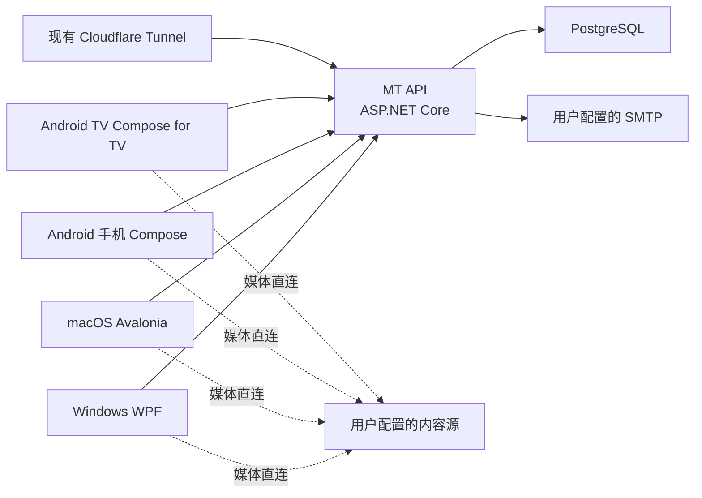

# MT播放器跨平台与账号同步设计规格

- 日期：2026-07-14
- 状态：已完成交互设计确认，等待规格审阅
- 适用项目：`D:\work\webhtv-windows`
- 产品名称：MT播放器

## 1. 背景

现有项目已经具备 Windows 10/11 原生 WPF 客户端、TVBox 配置导入、多片源搜索、影片详情、LibVLC 播放、收藏、观看记录、直播和安装包构建能力。下一阶段需要在保留 Windows 版本的基础上，补充 Android 手机、Android TV 和 macOS 客户端，并为四端接入可自行部署在群晖 Docker 上的账号与同步系统。

服务端通过用户已经部署的 Cloudflare Tunnel 对外提供 HTTPS 域名。群晖没有公网 IP，不要求开放公网端口。应用不内置、代理、缓存、上传或分发影视内容。

## 2. 目标与完成标准

### 2.1 产品目标

1. 交付 Windows、Android 手机、Android TV 和 macOS 四端客户端。
2. 游客不登录也能完整使用本地配置源、搜索、播放、收藏、历史和直播。
3. 登录后同步配置源、收藏、历史、播放进度、片头片尾和通用偏好。
4. 支持开放注册、邮箱验证、邮件找回、设备管理和中文网页管理后台。
5. 支持用户自有的群晖 Docker 与现有 Cloudflare Tunnel，不依赖公网 IP。
6. Windows 与 macOS 使用原生桌面窗口体验；Android 手机采用触控界面；Android TV 使用专门的遥控器焦点界面。
7. 各端均能实际解析并播放用户添加的合法内容源，不交付只有界面、不可播放的演示版本。

### 2.2 非目标

1. 服务端不作为视频代理、转码器、下载器或媒体存储。
2. 不预置第三方影视配置、播放接口、直播地址、台标或节目单。
3. 不开发 iPhone/iPad 版本。
4. 不在本阶段接入付费、订阅、广告或内容推荐运营系统。
5. 不要求用户重新部署 Cloudflare Tunnel。

## 3. 已选架构

采用按平台优化的混合架构：

- Windows：保留 .NET 8、WPF 与 LibVLCSharp，复用现有 Windows 代码。
- macOS：Avalonia UI、.NET 8 与 LibVLCSharp，复用桌面端领域模型、配置解析和目录逻辑。
- Android 手机：Kotlin、Jetpack Compose、Media3，必要时回退 LibVLC。
- Android TV：与手机版共享 Android 领域层，但 UI 使用 Compose for TV 和独立 TV 导航结构。
- 服务端：ASP.NET Core API、PostgreSQL 和内置后台任务。
- 客户端契约：OpenAPI 生成 .NET 与 Kotlin 客户端，避免手写两套协议产生偏差。

未采用全 Avalonia 的原因是 Android TV 遥控器、焦点管理和旧电视兼容风险较高；未采用完全独立的 SwiftUI macOS 客户端，是因为当前没有 Mac 开发机且会重复大量桌面逻辑；未采用全 MAUI，是因为 macOS 依赖 Mac Catalyst 且 TV 体验仍需大量平台代码。



服务端只处理账号和元数据同步。搜索、Spider 解析和媒体播放均在客户端本地完成。

## 4. 工程组织

为避免破坏现有 Windows 版本，实施阶段继续以 `D:\work\webhtv-windows` 为工作仓库，不先执行大规模重命名。推荐结构为：

```text
webhtv-windows/
├─ src/                         # 现有 .NET 桌面核心与 Windows 客户端
│  ├─ WebHtv.Core/
│  ├─ WebHtv.Configuration/
│  ├─ WebHtv.Catalogue/
│  ├─ WebHtv.Spider/
│  ├─ WebHtv.Playback/
│  ├─ WebHtv.Desktop/
│  ├─ MTPlayer.Mac/
│  └─ MTPlayer.Server/
├─ android/
│  ├─ core/
│  ├─ mobile/
│  └─ tv/
├─ contracts/                   # OpenAPI、同步与共享数据格式
├─ deploy/synology/
├─ installer/
├─ tests/
└─ docs/
```

现有内部项目名暂不做纯外观式重命名；对外产品名、窗口标题、安装包、图标和文档统一使用“MT播放器”。稳定发布后再决定是否重命名仓库。

## 5. 跨端界面与品牌

### 5.1 品牌规则

- 现有 `logo-header-transparent.png` 作为横版 Logo，用于 Windows/macOS 侧栏、登录页、关于页和安装程序欢迎页。
- 现有 `mtplayer-icon.png` 作为统一应用图标，用于 Windows EXE、安装包、桌面快捷方式、任务栏、Android 启动器、Android TV 应用列表、macOS App 和启动台。
- Logo 区域背景与素材深色背景保持一致，不出现明显色块边界。
- 海报悬停或焦点状态只做轻微抬升、缩放、红色描边和阴影，不使用整块白色覆盖。
- 进度条、音量条、滚动条、选择框和按钮均采用 MT 深色红黑主题，不显示平台默认白色控件。

### 5.2 Windows

- 左侧栏：首页、搜索、我的收藏、观看记录、直播频道、设置、关于软件、账户。
- 首页显示电影、电视剧、动漫电影、动漫番剧、综艺 Top 10 及继续观看。
- 搜索开始后隐藏 Top 10，只显示统一去重后的搜索结果。
- 鼠标、键盘均可操作；保留 Windows 窗口、最小化、最大化和全屏习惯。

### 5.3 macOS

- 使用桌面侧栏与工具栏搜索，遵循 macOS 窗口和全屏操作习惯。
- 功能与 Windows 保持一致，但不照搬 Windows 控件外观。
- 输出 Intel 与 Apple Silicon 通用 App/DMG。

### 5.4 Android 手机

- 底部导航：首页、搜索、直播、片库、我的。
- 竖屏浏览，横屏播放；支持触摸拖动进度、音量和亮度。
- 详情页使用适合触控的大按钮、可滚动剧集网格和固定播放入口。

### 5.5 Android TV

- 使用左侧导航栏、横向内容行和大尺寸卡片。
- 所有交互可只用方向键、确认键和返回键完成。
- 焦点卡片显示红色描边、抬升和缩放；焦点移动不会使海报变白。
- 登录使用二维码与设备码，文字输入仅作为备用方式。
- 剧集网格、接口、线路和播放器控制均针对远距离观看放大。

## 6. 配置源、搜索与详情

### 6.1 配置源管理

支持多个具名配置组。每个配置组包含名称、地址、类型、启用状态、更新时间和解析结果。用户可以新增、更新、启用、停用和删除配置组。

支持：

- TVBox 单仓和多仓配置。
- CMS/JSON/苹果 CMS 等常用 API。
- M3U、M3U8、TXT 直播源。
- XMLTV 节目单。
- 请求头、Cookie、Referer、User-Agent 和代理参数。

搜索同时调用所有已启用配置组中的可用片源，使用片名、年份、类型和集数进行去重。搜索结果保留来源信息，详情页允许切换接口与线路。

### 6.2 有效接口检测

详情页不直接展示配置中所有接口，而是：

1. 根据当前影片并行查询候选接口。
2. 仅保留确实返回该影片详情和有效剧集的接口。
3. 对接口设置连接、读取和总耗时限制。
4. 使用有限并发，避免一次打开详情发出过多请求。
5. 将检测结果短时缓存；配置更新或用户手动刷新时失效。
6. 默认隐藏失败接口，在“检测结果”中提供诊断信息，不弹出阻塞式错误框。

详情页的选择顺序固定为“播放接口 → 播放线路 → 剧集”。接口显示配置中的实际名称，禁止显示对象调试字符串或乱码。

## 7. Spider 与解析运行时

统一解析流程：

```text
配置源 → 搜索 → 影片详情 → 接口检测 → 线路/剧集
       → Spider 或解析器 → 最终媒体地址和请求头 → 本地播放器
```

### 7.1 通用运行时

- 原生直连：直接播放 HLS、DASH、HTTP 文件流和直播流。
- JSON 聚合：调用用户配置的解析 API 并提取最终地址。
- JavaScript Spider：桌面端使用受限 Jint 运行环境；Android 使用受限脚本环境。禁止脚本启动进程或任意访问本地文件，并设置超时与取消。
- 网页解析：只作为后台取址组件。Windows 使用 WebView2，Android 使用系统 WebView，macOS 使用系统 WebKit；应用主体界面仍为原生 UI。

### 7.2 TVBox JAR 兼容

- Android 端使用隔离的本地兼容层执行用户配置引用的 JAR Spider。
- Windows/macOS 使用独立的 `MTPlayer.SpiderBridge` Java 兼容进程，避免 JAR 崩溃拖垮主程序。
- Windows 单文件版首次需要 JAR 兼容时，将内置的最小运行环境释放到本地应用数据目录；安装版直接安装运行环境。macOS 将其放入 App 资源目录。
- JAR 属于用户添加的第三方可执行插件，首次启用时显示安全提示；设置超时、工作目录和进程终止边界。
- 无法兼容 Android 专有 API 的 JAR 必须返回明确的“不兼容”状态，不能假装解析成功。

该方案优先保证 CMS、JSON、JS 和常见 TVBox JAR 的实际可用性，同时承认任意第三方 JAR 无法保证百分之百跨平台兼容。

## 8. 播放器设计

### 8.1 播放引擎

- Windows/macOS：LibVLCSharp。
- Android：Media3 为首选；打开失败、编码不兼容或特殊直播流时自动尝试 LibVLC。
- 最终媒体地址、请求头、Cookie、字幕和音轨统一交给播放会话模型管理。

### 8.2 必备控制

- 播放/暂停、前后 10 秒、进度拖动、上一集、下一集。
- 音量、静音、默认音量、字幕、音轨、清晰度和全屏。
- 0.5x、0.75x、1.0x、1.25x、1.5x、2.0x 倍速，并明确显示“播放速度”。
- 硬件解码开关和失败后的软件解码回退。
- 播放错误显示可理解的中文原因和重试、切换接口操作。
- 控制栏在无操作 5 秒后隐藏；鼠标、触摸或遥控器重新操作时立即显示。

### 8.3 片头片尾与续播

片头片尾按“影片标识 + 播放接口 + 线路”保存：

- 片头保存需要跳到的秒数。
- 片尾保存距离结尾的秒数，以适应每集时长变化。
- 在播放器内设置、清除并显示当前值。
- 登录后跨设备同步；游客只保存在本地。

播放进度约每 15 秒、暂停、切集和退出时保存。重新播放时提供“继续播放”和“从头播放”。

## 9. 直播

- 导入本地文件或网络地址形式的 M3U/M3U8/TXT。
- 优先读取 `tvg-id`、`tvg-name`、`tvg-logo` 和 `group-title`。
- 台标匹配顺序：源中指定的台标 → `tvg-id` → 规范化频道名。
- XMLTV 节目单优先按 `tvg-id` 匹配，其次按规范化频道名匹配。
- 支持定时刷新、手动刷新、频道分组、收藏和最近观看。
- 播放失败可重试或切换同名备用频道地址。

## 10. 游客、账号与设备

### 10.1 游客模式

游客可以完整使用所有本地播放功能。登录只增加同步和设备管理能力，不是播放前置条件。服务器离线、账号未验证或令牌失效时，客户端回到本地优先状态，不删除本地数据。

### 10.2 注册与认证

- 开放邮箱注册。
- 邮箱验证、登录、退出、忘记密码和重置密码。
- 密码使用 Argon2id。
- 使用短期访问令牌和轮换刷新令牌；服务端只保存刷新令牌哈希。
- 邮箱验证与找回令牌一次性使用并自动过期。
- 注册、登录、找回和邮件接口均配置限流。
- Android TV 使用标准设备码流程：电视显示二维码和短码，手机网页登录确认。

### 10.3 设备管理

用户可以查看设备名称、平台、最近活动时间，单独撤销设备或让全部设备退出。管理员可禁用账号并撤销全部会话。

## 11. 同步设计

同步对象：

- 配置组、配置地址和启用状态。
- 收藏。
- 观看记录和播放进度。
- 每部影片的片头片尾。
- 默认倍速、默认音量、海报密度等通用偏好。

不同步：硬件解码选择、窗口大小、全屏状态和设备本地缓存。

### 11.1 增量同步

- 每条数据包含稳定 ID、版本、服务端更新时间和删除标记。
- 服务端维护变更日志与同步游标。
- 客户端先推送本地离线队列，再按游标拉取增量变化。
- 删除使用 tombstone，避免旧设备把已删除数据重新上传。
- 网络失败保留队列并指数退避重试，不阻塞本地播放。

### 11.2 冲突规则

- 收藏：集合并集；显式删除由较新服务端时间决定。
- 观看记录：保留最近观看时间和最新有效进度。
- 配置组：地址规范化后去重，名称冲突保留较新版本。
- 片头片尾与偏好：服务端最后修改时间优先。

游客首次登录时执行一次本地合并：收藏取并集，历史取最新，配置地址去重，片头片尾取最新修改。

## 12. 群晖服务端

### 12.1 容器

保持最简部署：

- `mt-api`：ASP.NET Core API、管理后台、邮件发件箱后台任务。
- `mt-db`：PostgreSQL。

不额外部署消息队列。邮件通过数据库 outbox 表保证重启后不丢失。

### 12.2 Cloudflare Tunnel 与端口规则

`https://XX.salego.cn` 仅是需求讨论中的示例，绝不写死到源码、安装包或 Docker 配置。

强制规则：

1. 客户端只保存并请求用户配置的 `https://实际域名`。
2. 客户端不显示、不要求也不拼接群晖内部端口。
3. 若 cloudflared 与 API 位于同一 Docker 网络，Tunnel 直接指向 `http://mt-api:8080`，无需映射群晖端口。
4. 若用户现有 Tunnel 从群晖主机或其他容器转发，可选将 API 映射到群晖局域网端口，再由 Tunnel 内部访问；该端口不提供给客户端。
5. API 正确处理 Cloudflare 转发的 HTTPS、主机和客户端地址请求头。
6. 正式发行客户端只接受 HTTPS 服务器地址；仅开发调试版本允许连接本机或局域网 HTTP 地址。

客户端首次尚未连接服务器时不可能从服务器读取其地址，因此必须采用以下任一绑定方式：

- 登录页首次手动输入 HTTPS 服务器地址。
- 扫描管理后台生成的配置二维码。
- 导入服务器配置文件。
- 官方打包时通过外部配置预设默认服务器地址。

绑定后地址保存在本地，可由用户修改。禁止在代码中硬编码某个域名。

## 13. 网页管理后台

后台地址为用户实际域名下的 `/admin`，提供中文界面：

- 用户查询、验证状态、禁用/解禁、设备数量和强制退出。
- 注册开关、强制邮箱验证开关、找回密码开关。
- SMTP 主机、端口、账号、密码、发件人、TLS/SSL。
- 服务公开地址，用于验证邮件、找回链接、二维码和配置文件。
- 发送测试邮件、发件状态和去敏后的错误日志。
- 验证/找回有效时间与接口限流设置。
- 邮件标题和正文模板。
- 系统状态、数据库状态、备份与恢复入口。
- 生成客户端服务器配置二维码和配置文件。

SMTP 密码使用服务端主密钥加密后存入数据库。后台只显示“已配置”，不能回显原密码。

首次部署使用 `/admin/setup` 和一次性 `ADMIN_SETUP_TOKEN` 创建管理员。创建成功后设置入口永久关闭；以后均通过管理员账号登录。

仅以下启动级机密保留在 Docker 环境变量或群晖 Secret 中：

```text
DATA_ENCRYPTION_KEY
DATABASE_PASSWORD
ADMIN_SETUP_TOKEN
```

SMTP 和公开域名均在网页后台填写，无需重新编辑 Docker Compose。

后台会对公开地址执行格式检查和一次连通性检查，但不会把示例域名自动写入数据库。用户未填写公开地址前，邮件测试和客户端配置二维码会明确提示“尚未配置”，不会生成错误链接。

## 14. 数据模型

核心表：

- `users`：邮箱、密码哈希、验证状态、禁用状态、角色和时间戳。
- `email_tokens`：验证和找回令牌哈希、用途、过期时间和使用时间。
- `device_sessions`：设备、刷新令牌哈希、最近活动和撤销状态。
- `configuration_groups`：加密地址、名称、类型和启用状态。
- `favorites`：用户、稳定内容标识和元数据摘要。
- `playback_history`：内容、集数、进度、时长和最近观看时间。
- `skip_markers`：内容、接口、线路、片头秒数和片尾剩余秒数。
- `preferences`：可同步的通用设置。
- `change_log`：用户级增量变化与同步游标。
- `mail_outbox`：邮件任务、重试次数和状态。
- `system_settings`：加密或普通后台设置。
- `audit_log`：管理员安全操作，不记录密码、令牌和完整配置地址。

配置地址、SMTP 密码等敏感字段使用 AES-256-GCM 和随机 nonce 字段加密。主密钥只来自 `DATA_ENCRYPTION_KEY`，不写入数据库或源码。

数据库与 `DATA_ENCRYPTION_KEY` 必须分别备份。数据库备份不包含明文机密；若主密钥丢失，加密的配置地址和 SMTP 密码无法恢复。服务端提供受控的密钥轮换命令：先用旧密钥解密并重新加密全部敏感字段，成功后才允许切换新密钥。轮换失败时保持旧数据和旧密钥可用。

## 15. API 边界

API 使用 `/api/v1` 版本前缀，主要端点：

```text
/auth/register
/auth/verify-email
/auth/login
/auth/refresh
/auth/forgot-password
/auth/reset-password
/auth/tv/device-code
/auth/tv/approve
/devices
/sync/push
/sync/pull
/admin/users
/admin/settings
/admin/email/test
/admin/client-config
/health/live
/health/ready
```

所有错误使用统一错误码、中文用户信息和请求追踪 ID。日志使用结构化格式，过滤密码、令牌、SMTP 密码、完整配置地址和媒体地址。

## 16. 构建、签名与交付

统一交付目录：`D:\work\MTPlayer\release`。

```text
release/
├─ windows/
│  ├─ MT播放器-Setup-x64.exe
│  ├─ MT播放器-Setup-x86.exe
│  ├─ MT播放器-x64.exe
│  └─ MT播放器-x86.exe
├─ android/
│  ├─ MT播放器-Mobile.apk
│  └─ MT播放器-TV.apk
├─ macos/
│  └─ MT播放器-universal.dmg
├─ server/
│  ├─ docker-compose.yml
│  ├─ Docker 镜像与部署文件
│  └─ 群晖部署说明
└─ source/
   └─ MTPlayer-完整源码.zip
```

Windows 安装程序显示免责声明、默认安装到 `C:\Program Files\mtplayer\`、创建可选桌面快捷方式并提供卸载程序。Android 手机和 TV 分别打包。服务端提供 `linux/amd64` 与 `linux/arm64` 镜像。

macOS 网站发布的 DMG 需要 Apple Developer ID 签名和苹果公证。由于当前没有 Mac，项目提供云端 macOS 构建脚本；签名与公证需要用户后续提供 Apple 开发者证书和凭据。没有证书时只能生成未签名测试 DMG，不能将其视为官网正式发行版。

## 17. 测试与验收

### 17.1 自动测试

- 配置解析、地址规范化、多仓展开和接口检测。
- 搜索合并、去重和有效接口过滤。
- Spider 超时、取消、崩溃隔离和错误映射。
- 播放会话、续播、片头片尾和上下集状态。
- 注册、验证、登录、刷新、找回、限流和设备撤销。
- AES-GCM 加解密、错误密钥和密钥轮换辅助工具。
- 离线队列、增量游标、tombstone 和冲突规则。
- M3U/XMLTV 解析及频道匹配。

### 17.2 实机验收

- Windows 10/11 x64 与 x86。
- Android 8.0 及以上手机，覆盖竖屏、横屏和后台恢复。
- Android TV 8.0 及以上，所有页面仅用遥控器完成操作。
- macOS 12 及以上 Intel 与 Apple Silicon 云端/实机验证。
- 群晖 amd64/arm64 中与实际目标机型匹配的部署验证。

### 17.3 发布门槛

1. 可添加多个具名配置组并同时搜索。
2. 搜索时隐藏首页 Top 10。
3. 详情页只显示包含该影片且可访问的接口。
4. 接口、线路、选集、进度、音量、静音、倍速、全屏、上下集、字幕和片头片尾均实际可操作。
5. 收藏、历史、进度和片头片尾可以跨至少两种客户端同步。
6. 断开 API 后游客和已登录用户仍可本地搜索与播放，恢复后自动同步。
7. Android TV 焦点不丢失、不出现无法返回或无法点击的页面。
8. M3U/M3U8、台标和 XMLTV 能导入、匹配和播放。
9. 客户端网络日志中只出现用户配置的 HTTPS 域名，不出现群晖内部端口。
10. 邮箱验证、找回密码、后台 SMTP 测试、用户禁用和设备撤销经过真实联调。
11. 安装、升级、卸载、首次启动和异常退出恢复通过检查。
12. 不存在点击搜索闪退、左侧导航无响应、海报点击无响应或播放器仅显示占位提示的已知阻断问题。

## 18. 版权与免责声明

安装程序、首次启动和“关于软件”页面明确说明：

- 软件不内置、不存储、不上传、不代理和不分发影视内容。
- 配置源、播放链接、直播地址、台标和节目单由用户自行添加。
- 用户必须在获得授权并符合所在地法律法规的前提下使用。
- 第三方配置源和 Spider 的可用性、安全性与版权责任由其提供者和使用者承担。

## 19. 尚待部署时填写的信息

以下信息不阻塞代码开发，但正式部署或签名时必须由用户提供：

- 实际 Cloudflare 公网 HTTPS 域名。
- SMTP 服务参数与发件邮箱。
- 群晖 CPU 架构和现有 cloudflared 到源站的连接方式。
- Apple Developer ID 证书与公证凭据。
- Android 正式签名密钥及保管密码。
- 最终版权主体、版本号和免责声明落款。

## 20. 参考资料

- [Android Developers: Compose for TV](https://developer.android.com/training/tv/playback/compose)
- [Avalonia Supported Platforms](https://docs.avaloniaui.net/docs/supported-platforms)
- [LibVLCSharp](https://github.com/videolan/libvlcsharp)
- [Apple Developer ID](https://developer.apple.com/support/developer-id/)
- [Apple notarization](https://developer.apple.com/documentation/security/notarizing-macos-software-before-distribution)
